# 🔐 Auth Service

A multi-tenant authentication and authorization microservice for SaaS applications, built with Java and Spring Boot.
Demonstrates clean architecture principles, comprehensive security practices, and modern development patterns.

## 🌐 Live Demo

| Resource                  | URL                                                          |
|---------------------------|--------------------------------------------------------------|
| **API Base URL**          | `https://auth-service.ivanhernandez.dev`                     |
| **Swagger UI (API Docs)** | https://auth-service.ivanhernandez.dev/swagger-ui/index.html |
| **OpenAPI Spec**          | https://auth-service.ivanhernandez.dev/v3/api-docs           |
| **MailHog UI**            | https://auth-service-mail.ivanhernandez.dev                  |

**Try it now:**

```bash
# Create a tenant
curl -X POST https://auth-service.ivanhernandez.dev/api/v1/tenants \
  -H "Content-Type: application/json" \
  -d '{"name": "My Company", "slug": "my-company"}'

# Register a user
curl -X POST https://auth-service.ivanhernandez.dev/api/v1/auth/register \
  -H "Content-Type: application/json" \
  -d '{
    "tenantSlug": "my-company",
    "email": "user@example.com",
    "password": "SecurePass123!",
    "firstName": "John",
    "lastName": "Doe"
  }'
```

---

## 📋 Overview

This service provides centralized authentication for multiple SaaS applications, eliminating the need for each app to
implement its own auth system. Instead of handling passwords, sessions, and security individually, everything is
delegated to this Auth Service.

**Key Features:**

- Multi-tenant architecture (one service, many clients)
- JWT-based authentication with refresh tokens
- Email verification and password reset flows
- Rate limiting to prevent abuse
- Clean hexagonal architecture

---

## 📖 What This API Does

### Core Functionality

This API handles **all authentication concerns** for your applications:

| Feature | Description |
|---------|-------------|
| **User Registration** | Create accounts with email verification |
| **Login/Logout** | Secure authentication with JWT tokens |
| **Token Management** | Access tokens (15 min) + Refresh tokens (30 days) |
| **Password Reset** | Secure email-based password recovery |
| **Profile Management** | Users can view and update their profile |
| **Multi-Tenancy** | Each client organization has isolated users |

### Multi-Tenant Architecture

The service supports multiple **tenants** (client organizations), each with their own isolated user base:

```mermaid
graph TB
    subgraph Auth Service
        subgraph Tenant A - acme
            A1[user1@a.com]
            A2[user2@a.com]
            A3[admin@a.com]
        end
        subgraph Tenant B - globex
            B1[user1@b.com]
            B2[user2@b.com]
            B3[admin@b.com]
        end
        subgraph Tenant C - initech
            C1[user1@c.com]
            C2[user2@c.com]
            C3[admin@c.com]
        end
    end
```

- Same email can exist in different tenants (user1@a.com in Acme ≠ user1@a.com in Globex)
- Each tenant is identified by a unique slug (acme, globex, initech)
- Tenants can be enabled/disabled independently

### How Authentication Works

#### 1. Registration

```mermaid
sequenceDiagram
    participant C as Client
    participant A as Auth API
    participant E as Email Service
    C->>A: POST /register {tenantSlug, email, password, name}
    A->>A: Hash password
    A->>A: Create user (unverified)
    A->>E: Send verification email
    A-->>C: 201 Created
    E-->>C: 📧 Verification Email
```



#### 2. Email Verification

```mermaid
sequenceDiagram
    participant U as User
    participant A as Auth API
    U->>A: GET /verify-email?token=xxx
    A->>A: Validate token
    A->>A: Mark user as verified ✓
    A-->>U: 200 OK
```



#### 3. Login


#### 4. Using Protected Endpoints


#### 5. Token Refresh


#### 6. Logout (Current Session)


#### 7. Logout All Devices


### Password Reset Flow


### Data Model


### Integration Example

How a frontend application would integrate with this API:

```javascript
// 1. Register a new user
const register = await fetch('/api/v1/auth/register', {
  method: 'POST',
  headers: { 'Content-Type': 'application/json' },
  body: JSON.stringify({
    tenantSlug: 'acme',
    email: 'user@example.com',
    password: 'SecurePass123!',
    firstName: 'John',
    lastName: 'Doe'
  })
});

// 2. Login after email verification
const login = await fetch('/api/v1/auth/login', {
  method: 'POST',
  headers: { 'Content-Type': 'application/json' },
  body: JSON.stringify({
    tenantSlug: 'acme',
    email: 'user@example.com',
    password: 'SecurePass123!'
  })
});
const { accessToken, refreshToken } = await login.json();

// 3. Access protected resources
const profile = await fetch('/api/v1/users/me', {
  headers: { 'Authorization': `Bearer ${accessToken}` }
});

// 4. Refresh token when access token expires
const refresh = await fetch('/api/v1/auth/refresh', {
  method: 'POST',
  headers: { 'Content-Type': 'application/json' },
  body: JSON.stringify({ refreshToken })
});
const { accessToken: newToken } = await refresh.json();

// 5. Logout (this session only)
await fetch('/api/v1/auth/logout', {
  method: 'POST',
  headers: { 
    'Authorization': `Bearer ${accessToken}`,
    'Content-Type': 'application/json'
  },
  body: JSON.stringify({ refreshToken })
});

// 6. Logout from all devices
await fetch('/api/v1/auth/logout-all', {
  method: 'POST',
  headers: { 'Authorization': `Bearer ${accessToken}` }
});
```

---

## 🎯 Skills Demonstrated

| Skill                            | Implementation                                                                                                       |
|----------------------------------|----------------------------------------------------------------------------------------------------------------------|
| **Hexagonal Architecture**       | Clear separation between domain, application, and infrastructure layers using ports & adapters pattern               |
| **SOLID Principles**             | Single responsibility per class, dependency inversion via interfaces, interface segregation with specific use cases  |
| **Domain-Driven Design**         | Rich domain models with business logic encapsulation                                                                 |
| **Clean Code**                   | Readable, maintainable, and testable code structure                                                                  |
| **DTOs with Named Constructors** | `fromDomain()` and `toDomain()` methods for clean object mapping without external libraries                          |
| **Custom Exceptions**            | Domain-specific exceptions (`UserNotFoundException`, `InvalidCredentialsException`, `TenantNotFoundException`, etc.) |
| **Global Exception Handling**    | Centralized `@RestControllerAdvice` for consistent error responses across the API                                    |
| **Input Validation**             | Bean Validation with `@Valid`, `@NotBlank`, `@Email`, `@Pattern` annotations and custom error messages               |
| **JWT Security**                 | Stateless authentication with access and refresh tokens, token blacklist for immediate revocation                   |
| **Rate Limiting**                | Redis-based request throttling per IP with in-memory fallback                                                        |
| **Token Blacklist**              | Immediate token invalidation on logout using Redis/in-memory storage with TTL                                        |
| **Multi-Tenancy**                | Data isolation per tenant organization                                                                               |
| **Email Integration**            | Async email sending for verification and password reset                                                              |
| **Testing**                      | Unit, integration, and end-to-end tests with JUnit 5, Mockito, and Spring Boot Test                                  |

---

## 🏗️ Hexagonal Architecture

The project follows Hexagonal Architecture (Ports & Adapters) to ensure a clean separation of concerns:


### Layer Responsibilities

| Layer              | Responsibility                                  | Dependencies         |
|--------------------|-------------------------------------------------|----------------------|
| **Domain**         | Business logic, entities, domain exceptions     | None (pure Java)     |
| **Application**    | Use cases, orchestration, DTOs, port interfaces | Domain only          |
| **Infrastructure** | Controllers, repositories, external services    | Application & Domain |

### Why Hexagonal?

- **Testability**: Domain and application layers can be unit tested without infrastructure
- **Flexibility**: Swap databases, frameworks, or APIs without changing business logic
- **Maintainability**: Clear boundaries make the codebase easier to understand

---

## 🔄 DTOs with Named Constructors

Instead of using external mapping libraries (MapStruct, ModelMapper), this project uses **named constructors** for
clean, explicit object mapping:

### Response DTO Example

```java
public record UserProfileResponse(
        UUID id,
        String email,
        String firstName,
        String lastName,
        String tenantSlug,
        String tenantName,
        List<String> roles,
        boolean emailVerified,
        LocalDateTime createdAt
) {
    public static UserProfileResponse fromDomain(User user) {
        return new UserProfileResponse(
                user.getId(),
                user.getEmail(),
                user.getFirstName(),
                user.getLastName(),
                user.getTenant().getSlug(),
                user.getTenant().getName(),
                user.getRoles().stream().map(Role::name).toList(),
                user.isEmailVerified(),
                user.getCreatedAt()
        );
    }
}
```

### JPA Entity Example

```java

@Entity
@Table(name = "users")
public class UserJpaEntity {
    @Id
    private UUID id;

    @ManyToOne(fetch = FetchType.LAZY)
    @JoinColumn(name = "tenant_id", nullable = false)
    private TenantJpaEntity tenant;

    private String email;
    private String passwordHash;
    // ... other fields

    public static UserJpaEntity fromDomain(User user, TenantJpaEntity tenantEntity) {
        UserJpaEntity entity = new UserJpaEntity();
        entity.id = user.getId();
        entity.tenant = tenantEntity;
        entity.email = user.getEmail();
        entity.passwordHash = user.getPasswordHash();
        entity.firstName = user.getFirstName();
        entity.lastName = user.getLastName();
        entity.emailVerified = user.isEmailVerified();
        entity.enabled = user.isEnabled();
        entity.roles = new HashSet<>(user.getRoles());
        entity.createdAt = user.getCreatedAt();
        entity.updatedAt = user.getUpdatedAt();
        return entity;
    }

    public User toDomain() {
        return new User(
                id,
                tenant.toDomain(),
                email,
                passwordHash,
                firstName,
                lastName,
                emailVerified,
                enabled,
                new HashSet<>(roles),
                createdAt,
                updatedAt
        );
    }
}
```

### Benefits

| Approach               | Pros                                                                        |
|------------------------|-----------------------------------------------------------------------------|
| **Named Constructors** | Explicit, type-safe, no reflection, easy to debug, no external dependencies |
| **External Mappers**   | Less boilerplate, automatic mapping                                         |

---

## ⚠️ Custom Exceptions

Domain-specific exceptions provide clear error semantics and enable proper HTTP status mapping:

### Exception Hierarchy

```java
// Thrown when user credentials are invalid
public class InvalidCredentialsException extends RuntimeException {
    public InvalidCredentialsException() {
        super("Invalid email or password");
    }
}

// Thrown when a user is not found
public class UserNotFoundException extends RuntimeException {
    public UserNotFoundException(String email) {
        super("User not found with email: " + email);
    }
}

// Thrown when trying to register an existing email
public class UserAlreadyExistsException extends RuntimeException {
    public UserAlreadyExistsException(String email) {
        super("User already exists with email: " + email);
    }
}

// Thrown when a tenant doesn't exist
public class TenantNotFoundException extends RuntimeException {
    public TenantNotFoundException(String slug) {
        super("Tenant not found with slug: " + slug);
    }
}

// Thrown when a token has expired
public class TokenExpiredException extends RuntimeException {
    public TokenExpiredException() {
        super("Token has expired");
    }
}
```

### Usage in Use Cases

```java

@Service
public class LoginUseCaseImpl implements LoginUseCase {

    @Override
    @Transactional
    public AuthResponse login(LoginRequest request, String ipAddress, String userAgent) {
        User user = userRepository.findByEmailAndTenantSlug(request.email(), request.tenantSlug())
                .orElseThrow(InvalidCredentialsException::new);

        if (!passwordEncoder.matches(request.password(), user.getPasswordHash())) {
            throw new InvalidCredentialsException();
        }

        if (!user.getTenant().isEnabled()) {
            throw new TenantDisabledException(request.tenantSlug());
        }

        if (!user.isEnabled()) {
            throw new UserDisabledException(request.email());
        }

        if (!user.isEmailVerified()) {
            throw new UserNotVerifiedException(request.email());
        }

        // Generate tokens and return response...
    }
}
```

---

## 🛡️ Global Exception Handling

A centralized `@RestControllerAdvice` catches all exceptions and returns consistent JSON error responses:

### GlobalExceptionHandler

```java

@RestControllerAdvice
public class GlobalExceptionHandler {

    @ExceptionHandler(InvalidCredentialsException.class)
    public ResponseEntity<ErrorResponse> handleInvalidCredentials(InvalidCredentialsException ex) {
        return ResponseEntity
                .status(HttpStatus.UNAUTHORIZED)
                .body(ErrorResponse.of(HttpStatus.UNAUTHORIZED.value(), ex.getMessage()));
    }

    @ExceptionHandler(UserNotFoundException.class)
    public ResponseEntity<ErrorResponse> handleUserNotFound(UserNotFoundException ex) {
        return ResponseEntity
                .status(HttpStatus.NOT_FOUND)
                .body(ErrorResponse.of(HttpStatus.NOT_FOUND.value(), ex.getMessage()));
    }

    @ExceptionHandler(UserAlreadyExistsException.class)
    public ResponseEntity<ErrorResponse> handleUserAlreadyExists(UserAlreadyExistsException ex) {
        return ResponseEntity
                .status(HttpStatus.CONFLICT)
                .body(ErrorResponse.of(HttpStatus.CONFLICT.value(), ex.getMessage()));
    }

    @ExceptionHandler(MethodArgumentNotValidException.class)
    public ResponseEntity<ValidationErrorResponse> handleValidation(MethodArgumentNotValidException ex) {
        Map<String, String> errors = new HashMap<>();
        ex.getBindingResult().getAllErrors().forEach(error -> {
            String fieldName = ((FieldError) error).getField();
            String errorMessage = error.getDefaultMessage();
            errors.put(fieldName, errorMessage);
        });
        return ResponseEntity
                .status(HttpStatus.BAD_REQUEST)
                .body(ValidationErrorResponse.of(
                        HttpStatus.BAD_REQUEST.value(),
                        "Validation failed",
                        errors
                ));
    }
}
```

### HTTP Status Mapping

| Exception                         | HTTP Status             | When                     |
|-----------------------------------|-------------------------|--------------------------|
| `InvalidCredentialsException`     | `401 Unauthorized`      | Wrong email/password     |
| `TokenExpiredException`           | `401 Unauthorized`      | Token has expired        |
| `TokenRevokedException`           | `401 Unauthorized`      | Token has been revoked   |
| `InvalidTokenException`           | `401 Unauthorized`      | Invalid token format     |
| `UserNotVerifiedException`        | `403 Forbidden`         | Email not verified       |
| `UserDisabledException`           | `403 Forbidden`         | User account is disabled |
| `TenantDisabledException`         | `403 Forbidden`         | Tenant is disabled       |
| `UserNotFoundException`           | `404 Not Found`         | User doesn't exist       |
| `TenantNotFoundException`         | `404 Not Found`         | Tenant doesn't exist     |
| `UserAlreadyExistsException`      | `409 Conflict`          | Email already registered |
| `RateLimitExceededException`      | `429 Too Many Requests` | Rate limit exceeded      |
| `MethodArgumentNotValidException` | `400 Bad Request`       | Validation failed        |

---

## ✅ Input Validation

Validation is implemented using Jakarta Bean Validation annotations with custom error messages:

### Request DTO

```java
public record RegisterRequest(
        @NotBlank(message = "Tenant slug is required")
        String tenantSlug,

        @NotBlank(message = "Email is required")
        @Email(message = "Invalid email format")
        String email,

        @NotBlank(message = "Password is required")
        @Size(min = 8, message = "Password must be at least 8 characters")
        @Pattern(
                regexp = "^(?=.*[a-z])(?=.*[A-Z])(?=.*\\d)(?=.*[@$!%*?&])[A-Za-z\\d@$!%*?&]+$",
                message = "Password must contain at least one uppercase letter, one lowercase letter, one number, and one special character"
        )
        String password,

        @NotBlank(message = "First name is required")
        @Size(max = 100, message = "First name must not exceed 100 characters")
        String firstName,

        @NotBlank(message = "Last name is required")
        @Size(max = 100, message = "Last name must not exceed 100 characters")
        String lastName
) {
}
```

### Controller Integration

```java

@PostMapping("/register")
public ResponseEntity<UserProfileResponse> register(@Valid @RequestBody RegisterRequest request) {
    UserProfileResponse response = registerUserUseCase.register(request);
    return ResponseEntity.status(HttpStatus.CREATED).body(response);
}
```

### Validation Error Response

```json
{
  "status": 400,
  "message": "Validation failed",
  "errors": {
    "email": "Invalid email format",
    "password": "Password must contain uppercase, lowercase, number, and special character"
  },
  "timestamp": "2026-01-12T10:30:00"
}
```

---

## 🔐 Security Model

### Token Configuration

| Token              | Duration   | Storage                     | Validation        |
|--------------------|------------|-----------------------------|-------------------|
| Access Token (JWT) | 15 minutes | Client memory               | Stateless (signature) |
| Refresh Token      | 30 days    | HTTP-Only Cookie + Database | Stateful (DB lookup)  |

### Token Lifecycle & Logout

```mermaid
flowchart TB
    subgraph LOGIN
        L1[User sends credentials]
        L2[Server generates Access Token - JWT signed]
        L3[Server generates Refresh Token - saved in DB]
        L4[Both tokens returned to client]
        L1 --> L2 --> L3 --> L4
    end

    subgraph USING_API[USING THE API]
        U1[Client sends Access Token in header]
        U2[Server verifies signature + expiration]
        U3[Server checks blacklist]
        U4{Valid?}
        U5[Request proceeds ✓]
        U6[401 Unauthorized ✗]
        U1 --> U2 --> U3 --> U4
        U4 -->|Yes| U5
        U4 -->|No| U6
    end

    subgraph LOGOUT
        O1[Access Token added to BLACKLIST]
        O2[TTL = remaining time until expiration]
        O3[Refresh Token REVOKED in database]
        O4[Subsequent requests with token → rejected]
        O1 --> O2
        O1 --> O3 --> O4
    end

    LOGIN --> USING_API
    USING_API --> LOGOUT
```



### Why Blacklist for Access Tokens?

| Token Type    | How it's validated          | How to revoke            |
|---------------|-----------------------------|--------------------------| 
| Refresh Token | Looked up in DB             | Delete from DB ✅        |
| Access Token  | Signature only (stateless)  | Cannot delete (not stored) → Blacklist needed |

Without blacklist, a stolen Access Token would remain valid for up to 15 minutes after logout.

### JWT Payload

```json
{
  "sub": "user-uuid",
  "email": "user@acme.com",
  "tenantId": "tenant-uuid",
  "tenantSlug": "acme",
  "roles": [
    "USER",
    "ADMIN"
  ],
  "iat": 1710000000,
  "exp": 1710000900
}
```

### Rate Limiting

| Endpoint                            | Limit      | Window     |
|-------------------------------------|------------|------------|
| `POST /auth/login`                  | 5 attempts | 15 minutes |
| `POST /auth/register`               | 3 attempts | 1 hour     |
| `POST /auth/password/reset-request` | 3 attempts | 1 hour     |
| `POST /auth/password/reset`         | 5 attempts | 1 hour     |

### Password Policy

- Minimum 8 characters
- At least 1 uppercase letter
- At least 1 lowercase letter
- At least 1 number
- At least 1 special character
- Hashed with BCrypt (cost factor 12)

---

## 📡 API Endpoints

### Authentication (`/api/v1/auth`)

| Method | Endpoint                  | Description            | Auth |
|--------|---------------------------|------------------------|------|
| `POST` | `/register`               | Register new user      | No   |
| `POST` | `/login`                  | Sign in                | No   |
| `POST` | `/refresh`                | Renew access token     | No   |
| `POST` | `/logout`                 | Sign out (this session only) | Yes  |
| `POST` | `/logout-all`             | Sign out all devices   | Yes  |
| `POST` | `/verify-email`           | Verify email address   | No   |
| `GET`  | `/verify-email?token=`    | Verify email via link  | No   |
| `POST` | `/password/reset-request` | Request password reset | No   |
| `POST` | `/password/reset`         | Reset password         | No   |

### Users (`/api/v1/users`)

| Method | Endpoint       | Description              | Auth |
|--------|----------------|--------------------------|------|
| `GET`  | `/me`          | Get current user profile | Yes  |
| `PUT`  | `/me`          | Update profile           | Yes  |
| `PUT`  | `/me/password` | Change password          | Yes  |

### Tenants (`/api/v1/tenants`)

| Method | Endpoint  | Description        | Auth |
|--------|-----------|--------------------|------|
| `POST` | `/`       | Create new tenant  | No*  |
| `GET`  | `/{slug}` | Get tenant by slug | No   |

---

## 🔄 Authentication Flows

### Registration Flow


### Login Flow


---

## 🗄️ Database Schema

```sql
-- Core Tables
tenants (id, name, slug, enabled, created_at)
users (id, tenant_id, email, password_hash, first_name, last_name, 
       email_verified, enabled, created_at, updated_at)
user_roles (user_id, role)

-- Token Tables
refresh_tokens (id, user_id, token_hash, expires_at, revoked, created_at)
email_verification_tokens (id, user_id, token, expires_at, used, created_at)
password_reset_tokens (id, user_id, token, expires_at, used, created_at)

-- Audit
login_attempts (id, user_id, email, tenant_slug, ip_address, user_agent, 
                success, attempted_at)
```

---

## 🔧 Tech Stack

| Category            | Technology                       |
|---------------------|----------------------------------|
| Language            | Java 21                          |
| Framework           | Spring Boot 3.4                  |
| Security            | Spring Security, JWT (jjwt)      |
| Persistence         | Spring Data JPA                  |
| Database (Dev)      | H2                               |
| Database (Prod)     | PostgreSQL                       |
| Cache/Rate Limiting/Token Blacklist | Redis                      |
| Email               | Spring Mail                      |
| Email (Dev)         | MailHog                          |
| Documentation       | SpringDoc OpenAPI                |
| Build               | Maven                            |
| Containerization    | Docker, Docker Compose           |
| Testing             | JUnit 5, Mockito, Testcontainers |

---

## 🚀 Running Locally

### Prerequisites

- Java 21
- Maven 3.9+
- Docker (for Redis/PostgreSQL)

### Development Mode

```bash
# Start the application with H2 database
mvn spring-boot:run -Dspring-boot.run.profiles=dev
```

### With Docker Compose

```bash
# Start all services (PostgreSQL, Redis, App)
docker-compose up -d
```

### Local URLs (Development)

| Resource     | URL                                   |
|--------------|---------------------------------------|
| API Base     | http://localhost:8082                 |
| Swagger UI   | http://localhost:8082/swagger-ui.html |
| OpenAPI Spec | http://localhost:8082/v3/api-docs     |
| H2 Console   | http://localhost:8082/h2-console      |
| MailHog UI   | http://localhost:8083                 |

---

## 📝 API Examples

### Create Tenant

```bash
curl -X POST http://localhost:8082/api/v1/tenants \
  -H "Content-Type: application/json" \
  -d '{
    "name": "ACME Corporation",
    "slug": "acme"
  }'
```

### Register User

```bash
curl -X POST http://localhost:8082/api/v1/auth/register \
  -H "Content-Type: application/json" \
  -d '{
    "tenantSlug": "acme",
    "email": "john@acme.com",
    "password": "SecurePass1!",
    "firstName": "John",
    "lastName": "Doe"
  }'
```

### Login

```bash
curl -X POST http://localhost:8082/api/v1/auth/login \
  -H "Content-Type: application/json" \
  -d '{
    "tenantSlug": "acme",
    "email": "john@acme.com",
    "password": "SecurePass1!"
  }'
```

### Get Profile (Authenticated)

```bash
curl http://localhost:8082/api/v1/users/me \
  -H "Authorization: Bearer <access_token>"
```

---

## 🧪 Testing

The project includes comprehensive tests following best practices:

### Test Structure

```
src/test/java/dev/ivanhernandez/authservice/
│
├── domain/
│   ├── model/
│   │   ├── UserTest.java
│   │   ├── TenantTest.java
│   │   ├── RefreshTokenTest.java
│   │   ├── EmailVerificationTokenTest.java
│   │   ├── PasswordResetTokenTest.java
│   │   └── LoginAttemptTest.java
│   └── exception/
│       └── DomainExceptionsTest.java
│
├── application/
│   └── usecase/
│       ├── RegisterUserUseCaseImplTest.java
│       ├── LoginUseCaseImplTest.java
│       ├── LogoutUseCaseImplTest.java
│       ├── RefreshTokenUseCaseImplTest.java
│       ├── VerifyEmailUseCaseImplTest.java
│       ├── RequestPasswordResetUseCaseImplTest.java
│       ├── ResetPasswordUseCaseImplTest.java
│       ├── GetUserProfileUseCaseImplTest.java
│       ├── UpdateUserProfileUseCaseImplTest.java
│       ├── ChangePasswordUseCaseImplTest.java
│       ├── CreateTenantUseCaseImplTest.java
│       └── GetTenantUseCaseImplTest.java
│
├── infrastructure/
│   ├── adapter/input/rest/
│   │   ├── AuthControllerTest.java
│   │   ├── UserControllerTest.java
│   │   └── TenantControllerTest.java
│   ├── adapter/output/persistence/
│   │   └── JpaUserRepositoryIntegrationTest.java
│   ├── adapter/output/security/
│   │   ├── BCryptPasswordEncoderAdapterTest.java
│   │   ├── JwtProviderImplTest.java
│   │   └── SecureTokenGeneratorTest.java
│   └── adapter/output/redis/
│       ├── InMemoryRateLimiterTest.java
│       └── InMemoryTokenBlacklistTest.java
│
└── AuthServiceIntegrationTest.java
```

### Test Categories

| Category              | Description                             | Tools                |
|-----------------------|-----------------------------------------|----------------------|
| **Unit Tests**        | Isolated tests with mocked dependencies | JUnit 5, Mockito     |
| **Domain Tests**      | Business logic and entity behavior      | JUnit 5              |
| **Exception Tests**   | Domain exception behavior verification  | JUnit 5              |
| **Controller Tests**  | REST endpoint testing with MockMvc      | @WebMvcTest, MockMvc |
| **Repository Tests**  | Database integration tests              | @DataJpaTest, H2     |
| **Integration Tests** | Full application context tests          | @SpringBootTest      |

### Test Naming Convention

```
methodName_shouldDoSomething_whenCondition
```

Example:

```java

@Test
@DisplayName("login should throw InvalidCredentialsException for wrong password")
void login_shouldThrowInvalidCredentialsException_forWrongPassword() {
    LoginRequest request = new LoginRequest("acme", "john@acme.com", "wrongpassword");

    when(userRepository.findByEmailAndTenantSlug("john@acme.com", "acme"))
            .thenReturn(Optional.of(user));
    when(passwordEncoder.matches("wrongpassword", "hashedPassword")).thenReturn(false);

    assertThrows(InvalidCredentialsException.class,
            () -> useCase.login(request, "127.0.0.1", "Mozilla"));

    verify(loginAttemptRepository).save(any());
    verify(refreshTokenRepository, never()).save(any());
}
```

### Running Tests

```bash
# Run all tests
mvn test

# Run with coverage
mvn test jacoco:report
```

---

## 🐳 Docker

### Build Image

```bash
docker build -t auth-service .
```

### Run with Docker Compose

```bash
docker-compose up -d
```

---

## 📊 Environment Variables

| Variable            | Description                               | Default               |
|---------------------|-------------------------------------------|-----------------------|
| `JWT_SECRET`        | Secret key for JWT signing (min 32 chars) | -                     |
| `DATABASE_URL`      | PostgreSQL connection URL                 | -                     |
| `DATABASE_USERNAME` | Database username                         | -                     |
| `DATABASE_PASSWORD` | Database password                         | -                     |
| `REDIS_HOST`        | Redis host                                | localhost             |
| `REDIS_PORT`        | Redis port                                | 6379                  |
| `MAIL_HOST`         | SMTP host                                 | -                     |
| `MAIL_PORT`         | SMTP port                                 | 587                   |
| `MAIL_USERNAME`     | SMTP username                             | -                     |
| `MAIL_PASSWORD`     | SMTP password                             | -                     |
| `APP_BASE_URL`      | Base URL for email links                  | http://localhost:8082 |

---

## 📁 Project Structure

```
src/main/java/dev/ivanhernandez/authservice/
├── AuthServiceApplication.java
├── domain/
│   ├── model/              # Domain entities (User, Tenant, RefreshToken, etc.)
│   └── exception/          # Domain exceptions
├── application/
│   ├── port/
│   │   ├── input/          # Use case interfaces
│   │   └── output/         # Repository/service interfaces
│   ├── usecase/            # Use case implementations
│   └── dto/                # Request/Response DTOs
└── infrastructure/
    ├── adapter/
    │   ├── input/rest/     # REST Controllers
    │   └── output/         # Repository implementations (JPA, Redis, Email)
    ├── config/             # Spring configurations (Security, OpenAPI, Async, etc.)
    └── exception/          # Global exception handler
```

---

## 📝 License

This project is licensed under the **Creative Commons Attribution-NonCommercial 4.0 International License (CC BY-NC 4.0)
**.

- ✅ Share and adapt the material
- ✅ Give appropriate credit
- ❌ Commercial use not permitted

[](https://creativecommons.org/licenses/by-nc/4.0/)
