# 🔐 Auth Service

A multi-tenant authentication and authorization microservice for SaaS applications, built with Java and Spring Boot.
Demonstrates clean architecture principles, comprehensive security practices, and modern development patterns.

## 🌐 Live Demo

| Resource                  | URL                                                          |
|---------------------------|--------------------------------------------------------------|
| **API Base URL**          | `https://auth-service.ivanhernandez.dev`                     |
| **Swagger UI (API Docs)** | https://auth-service.ivanhernandez.dev/swagger-ui/index.html |
| **OpenAPI Spec**          | https://auth-service.ivanhernandez.dev/v3/api-docs           |
| **MailHog UI**            | https://auth-service-mail.ivanhernandez.dev                  |

---

## 📑 Table of Contents

- [Overview](#-overview)
- [Quick Start](#-quick-start)
- [API Reference](#-api-reference)
  - [Endpoints](#endpoints)
  - [Examples](#examples)
  - [Authentication Flows](#authentication-flows)
- [Architecture](#-architecture)
  - [Hexagonal Architecture](#hexagonal-architecture)
  - [Project Structure](#project-structure)
  - [Data Model](#data-model)
- [Security](#-security)
  - [Token Configuration](#token-configuration)
  - [Rate Limiting](#rate-limiting)
  - [Password Policy](#password-policy)
- [Implementation Details](#-implementation-details)
  - [DTOs with Named Constructors](#dtos-with-named-constructors)
  - [Custom Exceptions](#custom-exceptions)
  - [Global Exception Handling](#global-exception-handling)
  - [Input Validation](#input-validation)
- [Development](#-development)
  - [Tech Stack](#tech-stack)
  - [Running Locally](#running-locally)
  - [Docker](#docker)
  - [Environment Variables](#environment-variables)
- [Testing](#-testing)
- [Skills Demonstrated](#-skills-demonstrated)
- [License](#-license)

---

## 📋 Overview

This service provides centralized authentication for multiple SaaS applications, eliminating the need for each app to implement its own auth system.

### Integrated Services

| Service | Description | Integration |
|---------|-------------|-------------|
| [URL Shortener](../url-shortener) | URL shortening service | Uses Token Introspection endpoint |

### Key Features

| Feature                 | Description                                      |
|-------------------------|--------------------------------------------------|
| **User Registration**   | Create accounts with email verification          |
| **Login/Logout**        | Secure authentication with JWT tokens            |
| **Token Management**    | Access tokens (15 min) + Refresh tokens (30 days)|
| **Password Reset**      | Secure email-based password recovery             |
| **Profile Management**  | Users can view and update their profile          |
| **Multi-Tenancy**       | Each client organization has isolated users      |

### Multi-Tenant Architecture

The service supports multiple **tenants** (client organizations), each with their own isolated user base:


- Same email can exist in different tenants
- Each tenant is identified by a unique slug
- Tenants can be enabled/disabled independently

---

## 🚀 Quick Start

### Option 1: Development Mode (No Dependencies)

```bash
mvn spring-boot:run -Dspring-boot.run.profiles=dev
```

### Option 2: Docker Compose (Full Stack)

```bash
docker-compose up -d
```

### Try the API

```bash
# Create a tenant
curl -X POST http://localhost:8082/api/v1/tenants \
  -H "Content-Type: application/json" \
  -d '{"name": "ACME Corp", "slug": "acme"}'

# Register a user
curl -X POST http://localhost:8082/api/v1/auth/register \
  -H "Content-Type: application/json" \
  -d '{
    "tenantSlug": "acme",
    "email": "user@example.com",
    "password": "SecurePass123!",
    "firstName": "John",
    "lastName": "Doe"
  }'
```

### Local URLs

| Resource     | URL                                          |
|--------------|----------------------------------------------|
| API Base     | http://localhost:8082                        |
| Swagger UI   | http://localhost:8082/swagger-ui/index.html  |
| H2 Console   | http://localhost:8082/h2-console (dev only)  |
| MailHog UI   | http://localhost:8083 (docker only)          |

---

## 📡 API Reference

### Endpoints

#### Authentication (`/api/v1/auth`)

| Method | Endpoint                  | Description                  | Auth |
|--------|---------------------------|------------------------------|------|
| `POST` | `/register`               | Register new user            | No   |
| `POST` | `/login`                  | Sign in                      | No   |
| `POST` | `/refresh`                | Renew access token           | No   |
| `POST` | `/introspect`             | Validate token (for services)| No   |
| `POST` | `/logout`                 | Sign out (current session)   | Yes  |
| `POST` | `/logout-all`             | Sign out all devices         | Yes  |
| `GET`  | `/verify-email?token=`    | Verify email via link        | No   |
| `POST` | `/password/reset-request` | Request password reset       | No   |
| `POST` | `/password/reset`         | Reset password               | No   |

#### Users (`/api/v1/users`)

| Method | Endpoint       | Description              | Auth |
|--------|----------------|--------------------------|------|
| `GET`  | `/me`          | Get current user profile | Yes  |
| `PUT`  | `/me`          | Update profile           | Yes  |
| `PUT`  | `/me/password` | Change password          | Yes  |

#### Tenants (`/api/v1/tenants`)

| Method | Endpoint  | Description        | Auth |
|--------|-----------|--------------------|------|
| `POST` | `/`       | Create new tenant  | No   |
| `GET`  | `/{slug}` | Get tenant by slug | No   |

### Examples

#### Login

```bash
curl -X POST http://localhost:8082/api/v1/auth/login \
  -H "Content-Type: application/json" \
  -d '{
    "tenantSlug": "acme",
    "email": "john@acme.com",
    "password": "SecurePass1!"
  }'
```

**Response:**

```json
{
  "accessToken": "eyJhbGciOiJIUzI1NiIs...",
  "refreshToken": "dGhpcyBpcyBhIHJlZnJl...",
  "expiresIn": 900
}
```

#### Get Profile (Authenticated)

```bash
curl http://localhost:8082/api/v1/users/me \
  -H "Authorization: Bearer <access_token>"
```

#### Logout (Current Session)

```bash
curl -X POST http://localhost:8082/api/v1/auth/logout \
  -H "Authorization: Bearer <access_token>" \
  -H "Content-Type: application/json" \
  -d '{"refreshToken": "<refresh_token>"}'
```

### Authentication Flows

#### Registration Flow

```mermaid
sequenceDiagram
    participant C as Client
    participant A as Auth API
    participant E as Email Service
    C->>A: POST /register
    A->>A: Hash password (BCrypt)
    A->>A: Create user (unverified)
    A->>E: Send verification email
    A-->>C: 201 Created
    E-->>C: 📧 Verification Email
```



#### Login Flow


#### Token Refresh Flow


#### Logout Flow


#### Password Reset Flow


---

## 🏗️ Architecture

### Hexagonal Architecture

The project follows Hexagonal Architecture (Ports & Adapters):


| Layer              | Responsibility                              | Dependencies         |
|--------------------|---------------------------------------------|----------------------|
| **Domain**         | Business logic, entities, exceptions        | None (pure Java)     |
| **Application**    | Use cases, DTOs, port interfaces            | Domain only          |
| **Infrastructure** | Controllers, repositories, external services| Application & Domain |

### Project Structure

```
src/main/java/dev/ivanhernandez/authservice/
├── AuthServiceApplication.java
├── domain/
│   ├── model/              # User, Tenant, RefreshToken, etc.
│   └── exception/          # Domain exceptions
├── application/
│   ├── port/
│   │   ├── input/          # Use case interfaces
│   │   └── output/         # Repository interfaces
│   ├── usecase/            # Use case implementations
│   └── dto/                # Request/Response DTOs
└── infrastructure/
    ├── adapter/
    │   ├── input/rest/     # REST Controllers
    │   └── output/         # JPA, Redis, Email adapters
    ├── config/             # Security, OpenAPI, Async configs
    └── exception/          # Global exception handler
```

### Data Model


---

## 🔐 Security

### Token Configuration

| Token              | Duration   | Storage       | Validation            |
|--------------------|------------|---------------|-----------------------|
| Access Token (JWT) | 15 minutes | Client memory | Stateless (signature) |
| Refresh Token      | 30 days    | Database      | Stateful (DB lookup)  |

#### JWT Payload

```json
{
  "sub": "user-uuid",
  "email": "user@acme.com",
  "tenantId": "tenant-uuid",
  "tenantSlug": "acme",
  "roles": ["USER"],
  "iat": 1710000000,
  "exp": 1710000900
}
```

#### Token Blacklist

Access tokens are **stateless** (validated by signature only). To enable immediate revocation on logout:

| Token Type    | Revocation Method                    |
|---------------|--------------------------------------|
| Refresh Token | Delete from database                 |
| Access Token  | Add to Redis blacklist (TTL-based)   |

### Rate Limiting

| Endpoint                   | Limit      | Window     |
|----------------------------|------------|------------|
| `POST /auth/login`         | 5 attempts | 15 minutes |
| `POST /auth/register`      | 3 attempts | 1 hour     |
| `POST /password/reset-*`   | 3 attempts | 1 hour     |

### Password Policy

- Minimum 8 characters
- At least 1 uppercase letter
- At least 1 lowercase letter  
- At least 1 number
- At least 1 special character
- Hashed with BCrypt

---

## 🔧 Implementation Details

### DTOs with Named Constructors

Instead of external mapping libraries, this project uses **named constructors**:

```java
public record UserProfileResponse(
        UUID id,
        String email,
        String firstName,
        String lastName,
        List<String> roles
) {
    public static UserProfileResponse fromDomain(User user) {
        return new UserProfileResponse(
                user.getId(),
                user.getEmail(),
                user.getFirstName(),
                user.getLastName(),
                user.getRoles().stream().map(Role::name).toList()
        );
    }
}
```

### Custom Exceptions

Domain-specific exceptions with proper HTTP status mapping:

```java
public class InvalidCredentialsException extends RuntimeException {
    public InvalidCredentialsException() {
        super("Invalid email or password");
    }
}

public class TenantNotFoundException extends RuntimeException {
    public TenantNotFoundException(String slug) {
        super("Tenant not found: " + slug);
    }
}
```

### Global Exception Handling

Centralized `@RestControllerAdvice` for consistent error responses:

```java
@RestControllerAdvice
public class GlobalExceptionHandler {

    @ExceptionHandler(InvalidCredentialsException.class)
    public ResponseEntity<ErrorResponse> handleInvalidCredentials(InvalidCredentialsException ex) {
        return ResponseEntity
                .status(HttpStatus.UNAUTHORIZED)
                .body(ErrorResponse.of(401, ex.getMessage()));
    }
}
```

#### HTTP Status Mapping

| Exception                     | HTTP Status             |
|-------------------------------|-------------------------|
| `InvalidCredentialsException` | `401 Unauthorized`      |
| `TokenExpiredException`       | `401 Unauthorized`      |
| `UserNotVerifiedException`    | `403 Forbidden`         |
| `TenantDisabledException`     | `403 Forbidden`         |
| `UserNotFoundException`       | `404 Not Found`         |
| `TenantNotFoundException`     | `404 Not Found`         |
| `UserAlreadyExistsException`  | `409 Conflict`          |
| `RateLimitExceededException`  | `429 Too Many Requests` |
| `MethodArgumentNotValid`      | `400 Bad Request`       |

### Input Validation

Jakarta Bean Validation with custom error messages:

```java
public record RegisterRequest(
        @NotBlank(message = "Tenant slug is required")
        String tenantSlug,

        @NotBlank @Email(message = "Invalid email format")
        String email,

        @Size(min = 8, message = "Password must be at least 8 characters")
        @Pattern(regexp = "^(?=.*[a-z])(?=.*[A-Z])(?=.*\\d)(?=.*[@$!%*?&]).*$")
        String password,

        @NotBlank String firstName,
        @NotBlank String lastName
) {}
```

---

## 💻 Development

### Tech Stack

| Category       | Technology                       | Version        |
|----------------|----------------------------------|----------------|
| Language       | Java                             | 25             |
| Framework      | Spring Boot                      | 3.5.0-SNAPSHOT |
| Security       | Spring Security + jjwt           | 0.12.6         |
| Persistence    | Spring Data JPA                  | -              |
| Database (Dev) | H2 (in-memory)                   | -              |
| Database (Prod)| PostgreSQL                       | 16             |
| Cache          | Redis                            | 7              |
| Email (Dev)    | MailHog                          | latest         |
| Documentation  | SpringDoc OpenAPI                | 2.8.4          |
| Build          | Maven                            | 3.9+           |
| Testing        | JUnit 5, Mockito, Testcontainers | 1.20.4         |

### Running Locally

#### Prerequisites

- Java 25
- Maven 3.9+
- Docker (optional)

#### Development Mode

```bash
mvn spring-boot:run -Dspring-boot.run.profiles=dev
```

- Uses H2 in-memory database
- Uses in-memory rate limiter and token blacklist
- H2 Console available at `/h2-console`

#### Docker Compose

```bash
docker-compose up -d
```

Starts: PostgreSQL, Redis, MailHog, and the API.

### Docker

```bash
# Build
docker build -t auth-service .

# Run
docker-compose up -d
```

### Environment Variables

| Variable            | Description                         | Default               |
|---------------------|-------------------------------------|-----------------------|
| `JWT_SECRET`        | JWT signing key (min 32 chars)      | -                     |
| `DATABASE_URL`      | PostgreSQL connection URL           | -                     |
| `DATABASE_USERNAME` | Database username                   | -                     |
| `DATABASE_PASSWORD` | Database password                   | -                     |
| `REDIS_HOST`        | Redis host                          | localhost             |
| `REDIS_PORT`        | Redis port                          | 6379                  |
| `MAIL_HOST`         | SMTP host                           | -                     |
| `MAIL_PORT`         | SMTP port                           | 587                   |
| `APP_BASE_URL`      | Base URL for email links            | http://localhost:8082 |

---

## 🧪 Testing

### Test Categories

| Category              | Description                             | Tools                |
|-----------------------|-----------------------------------------|----------------------|
| **Unit Tests**        | Isolated tests with mocked dependencies | JUnit 5, Mockito     |
| **Domain Tests**      | Business logic and entity behavior      | JUnit 5              |
| **Controller Tests**  | REST endpoint testing                   | @WebMvcTest, MockMvc |
| **Repository Tests**  | Database integration tests              | @DataJpaTest, H2     |
| **Integration Tests** | Full application context tests          | @SpringBootTest      |

### Running Tests

```bash
# Run all tests
mvn test

# Run with coverage
mvn test jacoco:report
```

### Test Naming Convention

```
methodName_shouldDoSomething_whenCondition
```

---

## 🔗 Integrating Other Services

Other microservices can validate JWT tokens using the **Token Introspection** endpoint.

### Token Introspection Endpoint

```
POST /api/v1/auth/introspect
```

**Request:**
```json
{
  "token": "eyJhbGciOiJIUzI1NiIs..."
}
```

**Response (valid token):**
```json
{
  "active": true,
  "userId": "550e8400-e29b-41d4-a716-446655440000",
  "tenantId": "660e8400-e29b-41d4-a716-446655440000",
  "tenantSlug": "acme",
  "email": "user@acme.com",
  "roles": ["USER"]
}
```

**Response (invalid/expired token):**
```json
{
  "active": false,
  "userId": null,
  "tenantId": null,
  "tenantSlug": null,
  "email": null,
  "roles": null
}
```

### Integration Example

```java
@Component
public class AuthServiceClient {

    private final RestClient restClient;

    public AuthServiceClient(@Value("${auth-service.base-url}") String baseUrl) {
        this.restClient = RestClient.builder().baseUrl(baseUrl).build();
    }

    public Optional<IntrospectResponse> introspect(String token) {
        var response = restClient.post()
                .uri("/api/v1/auth/introspect")
                .body(Map.of("token", token))
                .retrieve()
                .body(IntrospectResponse.class);
        
        return response.active() ? Optional.of(response) : Optional.empty();
    }
}
```

See the [URL Shortener](../url-shortener) for a complete integration example.

---

## 🎯 Skills Demonstrated

| Skill                            | Implementation                                                    |
|----------------------------------|-------------------------------------------------------------------|
| **Hexagonal Architecture**       | Ports & Adapters pattern with clear layer separation              |
| **SOLID Principles**             | Single responsibility, dependency inversion, interface segregation|
| **Domain-Driven Design**         | Rich domain models with business logic encapsulation              |
| **JWT Security**                 | Stateless auth with access/refresh tokens and blacklist           |
| **Rate Limiting**                | Redis-based throttling with in-memory fallback                    |
| **Multi-Tenancy**                | Data isolation per tenant organization                            |
| **Clean Code**                   | Readable, maintainable, testable structure                        |
| **Testing**                      | Unit, integration, and E2E tests                                  |

---

## 📝 License

This project is licensed under the **Creative Commons Attribution-NonCommercial 4.0 International License (CC BY-NC 4.0)**.

- ✅ Share and adapt the material
- ✅ Give appropriate credit
- ❌ Commercial use not permitted

[](https://creativecommons.org/licenses/by-nc/4.0/)
